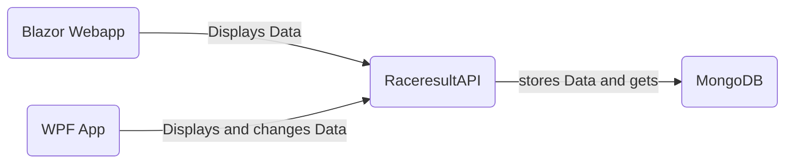
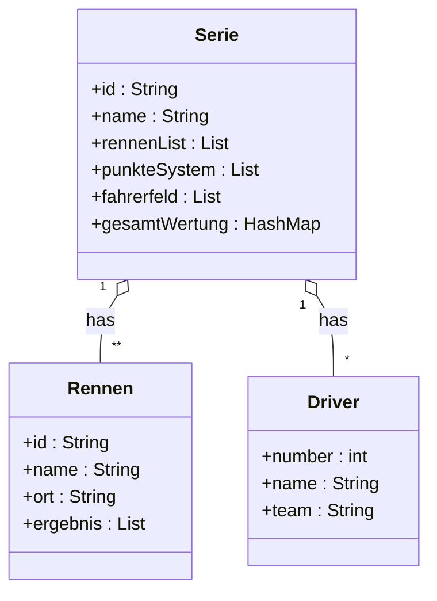

# RaceresultAPI
Dieses Projekt wurde als Semesterprojekt des Faches Programmieren und Softwareentwicklung erarbeitet. Es behandelt das große Thema der REST API's. Im Zusammenspiel mit einer solchen API war eine weitere Anforderung die Erstellung von 2 Clients, welche auf die API zugreifen. Bei diesen 2 Clients handelt es sich um eine WPF-Anwendung und eine Website. 

Meine Idee war eine API, mit welcher man Ergebnisse und Punktestände von Autorennserien erfassen kann. Es soll möglich sein grundlegende Daten über die Rennserie selbst, dessen Rennen und Fahrern zentral zu speichern und zugänglich zu machen. 

## Inhaltsverzeichnis
- [Softwaredesign](#softwaredesign)
- [Beschreibung der Software](#beschreibung-der-software)
- [API Beschreibung](#api-beschreibung)
- [Diagramme](#diagramme)
- [Diskussion](#diskussion)

<br>

## Softwaredesign



#### RaceresultAPI
Die RaceresultAPI ist das Kernstück des Projektes. Die API ist in Java programmiert und basiert auf dem Spring Boot Framework. Sie verwaltet alle Daten und speichert diese in eine MongoDB-Datenbank. 

#### Website mit Blazor Webassembly
Die Website dient als einfache Weboberfläche, mit welcher sich einfache Benutzer und Fans des Rennsports die gespeicherten Daten der RaceresultAPI einfach und schön gestaltet anschauen können. Für die Implementierung dieser Website habe ich mich für das Webframework Blazor entschieden, welches auf ASP.NET aufbaut. 

#### WPF Anwendung
Die WPF Anwendung dient als Verwaltungsprogramm der RaceresultAPI. Über die WPF Anwendung können alle Daten einfach hinzugefügt, geändert, gelöscht oder auch nur angezeigt werden. 

## Beschreibung der Software

#### RaceresultAPI
Wie unter dem Punkt [Software Design](#software-design) schon kurz angeschrochen wurde das Herz des Projekts, die API, mit Spring Boot umgesetzt. Dafür habe ich folgende Dependencies verwendet: 

```xml 
<dependencies>
        <dependency>
            <groupId>org.springframework.boot</groupId>
            <artifactId>spring-boot-starter-data-mongodb</artifactId>
        </dependency>
        <dependency>
            <groupId>org.springframework.boot</groupId>
            <artifactId>spring-boot-starter-web</artifactId>
        </dependency>
        <dependency>
            <groupId>org.springframework.boot</groupId>
            <artifactId>spring-boot-starter-test</artifactId>
            <scope>test</scope>
        </dependency>
    </dependencies>
```

Um die API verwenden zu können ist es notwendig Endpoints mit den benötigten Funktionen zur Verfügung zu stellen. Im folgenden Codeabschnitt ist die Implementierung des Endpoints <code><b>/state</b></code> zu sehen: 

```java
@RequestMapping(method = RequestMethod.GET, value = "/state")
public String getState() {
	return "{\\\"success\\\": true, \\\"message\\\": Das Service ist verfügbar!}";
}
```

Unter dem Punkt [API Beschreibung](#api-beschreibung) ist die Funktion und Verwendung der einzelnen Endpoints genauer beschrieben. 

#### Website mit Blazor Webassembly
Die Website basiert auf dem ASP.NET Blazor Webframework. Die wichtigsten Teile des Codes sind dabei die Zugriffe auf die API. 

##### GET-Request
Im folgenden Abschnitt ist ein GET-Request an die API implementiert. Außerdem beinhaltet der Codeausschnitt auch die Konvertierung des übergebenen JSON-Objektes zu einem C# Objekt. Für diese Konvertierung werden Methoden des Newtonsoft Json.NET Nugets verwendet.
```c#
try
{
	HttpClient client = new HttpClient();
	string json = await client.GetStringAsync(url);
	serie = JsonConvert.DeserializeObject<SerieData>(json);
	if(serie == null)
	{
		throw new ArgumentNullException();
	}
    StateHasChanged();
}
catch (Exception ex)
{
	Console.WriteLine(ex.Message);
}
```

Einen besonderen Augenmerk möchte ich dabei auf folgenden Funktionsaufruf legen:
```c# 
StateHasChanged();
``` 

Diese Funktion ist Teil des Blazor Frameworks und ermöglicht es, die HTML Ansicht neu zu laden, ohne dass der C# Code von neu ausgeführt wird.


##### Ändern der API-URL
Ein weiterer wichtiger Teil des Codes ist die Klasse <code>ConnectionData.cs</code>. Diese Klasse speichert die Verbindungsdaten der gewünschten RaceresultAPI Instanz. Außerdem löst diese Klasse ein Event aus, sobald sich die Verbindungsdaten geändert haben, damit die restliche Anwendung auf diese Veränderung reagieren kann. Die Implementierung der Klasse ist im folgenden Codeausschnitt zu sehen.
``` c#
public class ConnectionData
    {
    private string apiURL;
	public string url
	{
		get { return apiURL; }
		set
		{
			apiURL = value;
			raiseURLChangedEvent();
		}
	}

	public event EventHandler urlChanged;
	public event EventHandler connectingFinished;

	private void raiseURLChangedEvent()
	{
		urlChanged?.Invoke(this, null);
	}
	public void finishedConnecting()
	{
		connectingFinished?.Invoke(this, null);
	}
}
```

Beim Starten der Anwendung wird eine Instanz dieser Klasse als Singleton erstellt, damit jede Komponente auf die gleichen Daten zugreift. Dies kann man mit dem folgendem Funktionsaufruf im <code>Program.cs</code> Skript erreichen.
```c#
builder.Services.AddSingleton<ConnectionData>();
```

#### WPF Anwendung
Da die WPF Anwendung, gleich wie die Blazor WebApp, in C# implementiert wurde ist der Code, welcher für die Interaktion mit der RaceresultAPI zuständig ist, sehr ähnlich zu dem der Blazor WebApp. Lediglich die Codeteile, welche die Darstellung der Daten vornehmen unterscheidet sich. 

##### POST-Request 
Im nachfolgendem Codeabschnitt ist die Implementierung eines POST-Requests dargestellt.
```c#
 JObject json = new JObject
{
	{ "name", addName },
	{ "punkteSystem", punkteSys }
};

HttpContent content = new StringContent(json.ToString(), Encoding.UTF8, "application/json");

Task<string> response = new HttpClient().PostAsync(apiURL + "/addSeries", content).Result.Content.ReadAsStringAsync();
```
In diesem Fall wird der Endpoint <code>/addSeries</code> verwendet, um eine neue Rennserie hinzuzufügen.

##### PUT-Request
Im nachfolgendem Codeabschnitt ist die Implementierung eines PUT-Requests dargestellt.
```c#
Task<string> response = new HttpClient().PutAsync(url + "/" + name + "/updateDriver", content).Result.Content.ReadAsStringAsync();
```
In diesem Fall wird der Endpoint <code>/{Serie}/updateDriver</code> verwendet, um die Daten eines Fahrers zu ändern.

##### DELETE-Request
Im nachfolgendem Codeabschnitt ist die Implementierung eines DELETE-Requests dargestellt.
```c#
Task<string> response = new HttpClient().DeleteAsync(apiURL + "/" + selectSeries.Text + "/delete").Result.Content.ReadAsStringAsync();

```
In diesem Fall wird der Endpoint <code>/{Name}/delete</code> verwendet, um eine Rennserie zu löschen.

## API Beschreibung

### Rennserie
<details>
 <summary><code>POST</code> <code><b>/addSeries</b></code> <code>(Fügt eine Serie hinzu)</code></summary>

##### Parameters

> | data type      | type         | format                  | description                                                   |
> |----------------|--------------|-------------------------|---------------------------------------------------------------|
> | Serie          | Requestbody  | object (JSON or YAML)   | N/A  |


##### Responses

> |content-type             | response example / description                                                                |
> |-------------------------|-----------------------------------------------------------------------------------------------|
> |`json string`       | `{"success":"true","message":"Success Message"}`                                              |


</details>
<details>
 <summary><code>GET</code> <code><b>/getSeries</b></code> <code>(Gibt alle Serien zurück)</code></summary>

##### Parameters

> | data type      | type         | format                  | description                                                   |
> |----------------|--------------|-------------------------|---------------------------------------------------------------|
> | None          | -  | -   | N/A  |


##### Responses

> |content-type             | response example / description                                                                |
> |-------------------------|-----------------------------------------------------------------------------------------------|
> |`json string`       | `JSON Liste an Serien`                                              |


</details>
<details>
 <summary><code>GET</code> <code><b>/{Name}</b></code> <code>(Gibt eine Serie zurück)</code></summary>

##### Parameters

> | data type      | type         | format                  | description                                                   |
> |----------------|--------------|-------------------------|---------------------------------------------------------------|
> | String          | Path  | String   | {Name} der gewünschten Serie  |


##### Responses

> |content-type             | response example / description                                                                |
> |-------------------------|-----------------------------------------------------------------------------------------------|
> |`json string`       | `JSON Objekt der Serie`                                              |


</details>
<details>
 <summary><code>GET</code> <code><b>/getSeriesNames</b></code> <code>(Gibt die Namen aller Serien zurück)</code></summary>

##### Parameters

> | data type      | type         | format                  | description                                                   |
> |----------------|--------------|-------------------------|---------------------------------------------------------------|
> | None          | -  | -   | N/A  |


##### Responses

> |content-type             | response example / description                                                                |
> |-------------------------|-----------------------------------------------------------------------------------------------|
> |`json string`       | `JSON String-Liste an Seriennamen`                                              |


</details>
<details>
 <summary><code>DELETE</code> <code><b>/{Name}/delete</b></code> <code>(Löscht eine Serie)</code></summary>

##### Parameters

> | data type      | type         | format                  | description                                                   |
> |----------------|--------------|-------------------------|---------------------------------------------------------------|
> | String          | Path  | String   | {Name} der gewünschten Serie  |


##### Responses

> |content-type             | response example / description                                                                |
> |-------------------------|-----------------------------------------------------------------------------------------------|
> |`json string`       | `{"success":"true","message":"Success Message"}`                                              |


</details>
<details>
 <summary><code>GET</code> <code><b>/{Serie}/getStandings</b></code> <code>(Gibt den Gesamtstand einer Serie zurück)</code></summary>

##### Parameters

> | data type      | type         | format                  | description                                                   |
> |----------------|--------------|-------------------------|---------------------------------------------------------------|
> | String          | Path  | String   | Name der gewünschten {Serie}  |


##### Responses

> |content-type             | response example / description                                                                |
> |-------------------------|-----------------------------------------------------------------------------------------------|
> |`json string`       | `JSON Integer-Hashmap des aktuellen Gesamtstands`                                              |

  
</details>
<details>
 <summary><code>GET</code> <code><b>/{Serie}/getPunkteSystem</b></code> <code>(Gibt das Punktesystem einer Serie zurück)</code></summary>

##### Parameters

> | data type      | type         | format                  | description                                                   |
> |----------------|--------------|-------------------------|---------------------------------------------------------------|
> | String          | Path  | String   | Name der gewünschten {Serie}  |


##### Responses

> |content-type             | response example / description                                                                |
> |-------------------------|-----------------------------------------------------------------------------------------------|
> |`json string`       | `JSON Integer-List des Punktesystems`                                              |

  
</details>

### Rennen
<details>
 <summary><code>POST</code> <code><b>/{Serie}/addResult</b></code> <code>(Fügt ein Rennen zu einer Serie hinzu)</code></summary>

##### Parameters

> | data type      | type         | format                  | description                                                   |
> |----------------|--------------|-------------------------|---------------------------------------------------------------|
> | String          | Path  | String   | Name der gewünschten {Serie}  |
> | Rennen | Requestbody | object (JSON or YAML) | N/A |   


##### Responses

> |content-type             | response example / description                                                                |
> |-------------------------|-----------------------------------------------------------------------------------------------|
> |`json string`       | `{"success":"true","message":"Success Message"}`                                              |


</details>
<details>

 <summary><code>GET</code> <code><b>/{Serie}/getResults</b></code> <code>(Gibt alle Rennen einer Serie zurück)</code></summary>

##### Parameters

> | data type      | type         | format                  | description                                                   |
> |----------------|--------------|-------------------------|---------------------------------------------------------------|
> | String          | Path  | String   | Name der gewünschten {Serie}  |


##### Responses

> |content-type             | response example / description                                                                |
> |-------------------------|-----------------------------------------------------------------------------------------------|
> |`json string`       | `JSON Liste an Rennen`                                              |

  
</details>
<details>
 <summary><code>GET</code> <code><b>/{Serie}/getResult/{id}</b></code> <code>(Gibt ein Rennen einer Serie zurück)</code></summary>

##### Parameters

> | data type      | type         | format                  | description                                                   |
> |----------------|--------------|-------------------------|---------------------------------------------------------------|
> | String          | Path  | String   | Name der gewünschten {Serie}  |
> | String          | Path  | String   | {id} des gewünschten Rennens  |


##### Responses

> |content-type             | response example / description                                                                |
> |-------------------------|-----------------------------------------------------------------------------------------------|
> |`json string`       | `JSON Objekt des gewünschten Rennens`                                              |

  
</details>
<details>
 <summary><code>PUT</code> <code><b>/{Serie}/updateResult</b></code> <code>(Updatet ein Rennen einer Serie)</code></summary>

##### Parameters

> | data type      | type         | format                  | description                                                   |
> |----------------|--------------|-------------------------|---------------------------------------------------------------|
> | String          | Path  | String   | Name der gewünschten {Serie}  |
> | Rennen | Requestbody | object (JSON or YAML) | N/A |   


##### Responses

> |content-type             | response example / description                                                                |
> |-------------------------|-----------------------------------------------------------------------------------------------|
> |`json string`       | `{"success":"true","message":"Success Message"}`                                              |

  
</details>
<details>
 <summary><code>DELETE</code> <code><b>/{Serie}/deleteResult/{id}</b></code> <code>(Löscht ein Rennen einer Serie)</code></summary>

##### Parameters

> | data type      | type         | format                  | description                                                   |
> |----------------|--------------|-------------------------|---------------------------------------------------------------|
> | String          | Path  | String   | Name der gewünschten {Serie}  |
> | String          | Path  | String   | {id} des gewünschten Rennens  |

  
##### Responses

> |content-type             | response example / description                                                                |
> |-------------------------|-----------------------------------------------------------------------------------------------|
> |`json string`       | `{"success":"true","message":"Success Message"}`                                              |


</details>

### Drivers
<details>
 <summary><code>POST</code> <code><b>/{Serie}/addDriver</b></code> <code>(Fügt einen Fahrer zu einer Serie hinzu)</code></summary>

##### Parameters

> | data type      | type         | format                  | description                                                   |
> |----------------|--------------|-------------------------|---------------------------------------------------------------|
> | String          | Path  | String   | Name der gewünschten {Serie}  |
> | Driver | Requestbody | object (JSON or YAML) | N/A |   


##### Responses

> |content-type             | response example / description                                                                |
> |-------------------------|-----------------------------------------------------------------------------------------------|
> |`json string`       | `{"success":"true","message":"Success Message"}`                                              |

  
</details>
<details>
 <summary><code>GET</code> <code><b>/{Serie}/getDrivers</b></code> <code>(Gibt alle Fahrer einer Serie zurück)</code></summary>

##### Parameters

> | data type      | type         | format                  | description                                                   |
> |----------------|--------------|-------------------------|---------------------------------------------------------------|
> | String          | Path  | String   | Name der gewünschten {Serie}  |


##### Responses

> |content-type             | response example / description                                                                |
> |-------------------------|-----------------------------------------------------------------------------------------------|
> |`json string`       | `JSON Liste an Fahrern`                                              |

  
  
</details>
<details>
 <summary><code>GET</code> <code><b>/{Serie}/getDriver/{Nr}</b></code> <code>(Gibt einen Fahrer einer Serie zurück)</code></summary>

##### Parameters

> | data type      | type         | format                  | description                                                   |
> |----------------|--------------|-------------------------|---------------------------------------------------------------|
> | String          | Path  | String   | Name der gewünschten {Serie}  |
> | String          | Path  | String   | {id} des gewünschten Fahrers  |


##### Responses

> |content-type             | response example / description                                                                |
> |-------------------------|-----------------------------------------------------------------------------------------------|
> |`json string`       | `JSON Objekt des gewünschten Fahrers`                                              |

  
</details>
<details>
 <summary><code>PUT</code> <code><b>/{Serie}/updateDriver</b></code> <code>(Updatet einen Fahrer einer Serie)</code></summary>

##### Parameters

> | data type      | type         | format                  | description                                                   |
> |----------------|--------------|-------------------------|---------------------------------------------------------------|
> | String          | Path  | String   | Name der gewünschten {Serie}  |
> | Driver | Requestbody | object (JSON or YAML) | N/A |   


##### Responses

> |content-type             | response example / description                                                                |
> |-------------------------|-----------------------------------------------------------------------------------------------|
> |`json string`       | `{"success":"true","message":"Success Message"}`                                              |

  
</details>
<details>
 <summary><code>DELETE</code> <code><b>/{Serie}/deleteDriver/{Nr}</b></code> <code>(Löscht einen Fahrer einer Serie)</code></summary>

##### Parameters

> | data type      | type         | format                  | description                                                   |
> |----------------|--------------|-------------------------|---------------------------------------------------------------|
> | String          | Path  | String   | Name der gewünschten {Serie}  |
> | String          | Path  | String   | {id} des gewünschten Fahrers  |

  
##### Responses

> |content-type             | response example / description                                                                |
> |-------------------------|-----------------------------------------------------------------------------------------------|
> |`json string`       | `{"success":"true","message":"Success Message"}`                                              |


</details>

### Verwaltung 
<details>
 <summary><code>GET</code> <code><b>/state</b></code> <code>(Gibt den Status der API zurück)</code></summary>

##### Parameters

> | data type      | type         | format                  | description                                                   |
> |----------------|--------------|-------------------------|---------------------------------------------------------------|
> | None          | -  | -   | N/A  |


##### Responses

> |content-type             | response example / description                                                                |
> |-------------------------|-----------------------------------------------------------------------------------------------|
> |`json string`       | `{"success":"true","message":"Das Service ist verfügbar!"}`  |

  
</details>

### Datentypen
<details>
<summary><code><b>Serie</b></code><code>(Abbildung einer Rennserie)</code></summary>


##### Membervariablen
> | Datentyp | Name | Beschreibung | Required |
> |----------------|--------------|-----------------------|--------------|
> | String          | id  | uniqe, auto generated   | no  |
> | String          | name  | N/A   | yes  |
> | List (Rennen)          | rennenList  | N/A   | no  |
> | List (Integer)          | punkteSystem  | N/A   | yes  |
> | List (Driver)          | fahrerfeld  | N/A   | no  |
> | Hashmap (Integer, Integer)          | gesamtWertung  | N/A   | no  |

##### Example JSON POST
``` json
{
    "name": "WRC",
    "punkteSystem": [
        25,
        18,
        15,
        12,
        10,
        8,
        6,
        4,
        2,
        1
    ]
}
```


</details>
<details>
<summary><code><b>Rennen</b></code><code>(Abbildung eines Rennens)</code></summary>


##### Membervariablen
> | Datentyp | Name | Beschreibung | Required |
> |----------------|--------------|-----------------------|--------------|
> | String          | id  | uniqe, auto generated   | yes  |
> | String          | name  | N/A   | yes  |
> | String          | ort  | N/A   | yes  |
> | List (Integer)          | ergebnis  | N/A   | yes  |

##### Example JSON POST
```json
{
    "name":"Rally Monte Carlo",
    "ort":"Monto Carlo",
    "ergebnis":[
        11,
        22,
        33,
        44,
        55,
        66,
        77,
        88,
        99
    ]
}
```

##### Example JSON PUT
```json
{
	"id":"d4d472b0-5a87-40e6-89ff-1541f7c75048",
    "name":"Rally Monte Carlo",
    "ort":"Monto Carlo",
    "ergebnis":[
        11,
        22,
        33,
        44,
        55,
        66,
        77,
        88,
        99
    ]
}
```

</details>
<details>
<summary><code><b>Driver</b></code><code>(Abbildung eines Fahrer)</code></summary>


##### Membervariablen
> | Datentyp | Name | Beschreibung | Required |
> |----------------|--------------|-----------------------|--------------|
> | Integer          | number  | N/A | yes  |
> | String          | name  | N/A | yes  |
> | String          | team  | N/A   | yes  |

##### Example JSON POST
```json
{
    "number":33,
    "name":"VITUS",
    "team":"BMW"
}
```

##### Example JSON PUT
```json
{
    "number":33,
    "name":"VITUS",
    "team":"BMW"
}
```

</details>

## Diagramme
Das folgende UML-Klassendiagramm zeigt die Beziehungen und Eigenschaften der Datentypen, mit welchen die RaceresultAPI arbeitet.


## Diskussion
Der Endstand des Projektes kann in 3 einzelne Programme aufgeteilt werden, welche gemeinsam ein komplettes System darstellen. Die RaceresultAPI ist eine einfache REST-API, welche Daten über und um Rennserien verwaltet und speichert. Die Speicherung erfolgt dabei mit einer MongoDB Datenbank. Die WPF Anwendung dient als Verwaltungssoftware und ermöglicht es Daten einfach und übersichtlich an die RaceresultAPI zu schicken oder bearbeiten. Das Ziel der WebApp hingegen ist es die Daten der RaceresultAPI schön darzustellen und sollte hauptsächlich als Informationsquelle für interessierte Fans fungieren.

Die Erarbeitung dieses Projektes verlief im großen betrachtet sehr gut. Die Implementierung der REST-API in Spring war dabei der einfachste Teil, da ich mit damit vor dem Projekt schon am meisten Erfahrung hatte. Die Arbeit um die WPF Anwendung war hingegen etwas schwerer, da ich mit WPF bis zu diesem Projekt nur wenig Erfahrung beziehungsweise Berührungspunkte hatte. Durch Recherche im Internet waren allerdings alle Probleme relativ leicht zu lösen. Blazor hingegen war für mich komplettes Neuland und somit auch Anfangs sehr undurchsichtig und verwirrend. Auch hier fand ich allerdings eine Lösung für alle meine Probleme im Internet. Nach dem erarbeiten des Projektes kann ich Blazor allerdings nur jedem empfehlen, da es mit diesem Framework sehr einfach und schnell möglich ist funktionale und optisch ansprechende Websiten zu erstellen. Ein netter Bonuspunkt ist dabei die komplette Meidung von JavaScript. In meinem Fall ist C# viel öfters arbeite und dadurch auch schneller arbeiten kann als in JavaScript

### Mögliche Erweiterungen
#### Erweiterung der Fahrerteams
Eine mögliche Erweiterung wäre die Implementierung der Fahrerteams. Zum jetzigen Stand sind die Teams nur als String im Fahrer abgebildet und haben eigentlich keine weitere Funktion. Hier wäre es noch möglich eine Teamwertung, wie es auch aus zahlreichen Autorennserien bekannt sein sollte, zu implementieren.

#### Darstellung
Die Darstellung auf der WebApp könnte mithilfe von Bildern oder Icons noch verschönert und ansprechender gemacht werden. So könnte man bei den einzelnen Fahrern ein Portrait anzeigen und somit eine engere Verbindung mit den wirklichen Personen 
