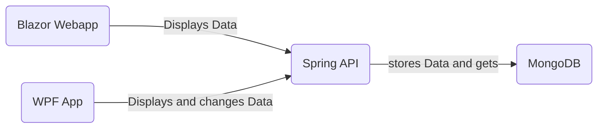

## Beschreibung der Software

#### RaceAPI
Die RaceAPI ist das Kernstück des Projektes. Die API ist in Java programmiert und basiert auf dem Spring Boot Framework. Sie verwaltet alle Daten und speichert diese in eine MongoDB-Datenbank. 

#### Website mit Blazor Webassembly
Die Website dient als einfache Weboberfläche, mit welcher sich einfache Benutzer und Fans des Rennsports die gespeicherten Daten der RaceAPI einfach und schön gestaltet anschauen können. Für die Implementierung dieser Website habe ich mich für das Webframework Blazor entschieden, welches auf ASP.NET aufbaut. 

#### WPF Anwendung
Die WPF Anwendung dient als Verwaltungsprogramm der RaceAPI. Über die WPF Anwendung können alle Daten einfach hinzugefügt, geändert, gelöscht oder auch nur angezeigt werden. 

## Softwaredesign

## API Beschreibung

### Rennserie

 
<code>POST</code> <code><b>/addSeries</b></code> <code>(Fügt eine Serie hinzu)</code>

##### Parameters

> | data type      | type         | format                  | description                                                   |
> |----------------|--------------|-------------------------|---------------------------------------------------------------|
> | Serie          | Requestbody  | object (JSON or YAML)   | N/A  |

##### Responses

> |content-type             | response example / description                                                                |
> |-------------------------|-----------------------------------------------------------------------------------------------|
> |`json string`       | `{"success":"true","message":"Success Message"}`                                              |

 
<code>GET</code> <code><b>/getSeries</b></code> <code>(Gibt alle Serien zurück)</code>

##### Parameters

> | data type      | type         | format                  | description                                                   |
> |----------------|--------------|-------------------------|---------------------------------------------------------------|
> | None          | -  | -   | N/A  |

##### Responses

> |content-type             | response example / description                                                                |
> |-------------------------|-----------------------------------------------------------------------------------------------|
> |`json string`       | `JSON Liste an Serien`                                              |

 
<code>GET</code> <code><b>/{Name}</b></code> <code>(Gibt eine Serie zurück)</code>

##### Parameters

> | data type      | type         | format                  | description                                                   |
> |----------------|--------------|-------------------------|---------------------------------------------------------------|
> | String          | Path  | String   | {Name} der gewünschten Serie  |

##### Responses

> |content-type             | response example / description                                                                |
> |-------------------------|-----------------------------------------------------------------------------------------------|
> |`json string`       | `JSON Objekt der Serie`                                              |

 
<code>GET</code> <code><b>/getSeriesNames</b></code> <code>(Gibt die Namen aller Serien zurück)</code>

##### Parameters

> | data type      | type         | format                  | description                                                   |
> |----------------|--------------|-------------------------|---------------------------------------------------------------|
> | None          | -  | -   | N/A  |

##### Responses

> |content-type             | response example / description                                                                |
> |-------------------------|-----------------------------------------------------------------------------------------------|
> |`json string`       | `JSON String-Liste an Seriennamen`                                              |

 
<code>DELETE</code> <code><b>/{Name}/delete</b></code> <code>(Löscht eine Serie)</code>

##### Parameters

> | data type      | type         | format                  | description                                                   |
> |----------------|--------------|-------------------------|---------------------------------------------------------------|
> | String          | Path  | String   | {Name} der gewünschten Serie  |

##### Responses

> |content-type             | response example / description                                                                |
> |-------------------------|-----------------------------------------------------------------------------------------------|
> |`json string`       | `{"success":"true","message":"Success Message"}`                                              |

 
<code>GET</code> <code><b>/{Serie}/getStandings</b></code> <code>(Gibt den Gesamtstand einer Serie zurück)</code>

##### Parameters

> | data type      | type         | format                  | description                                                   |
> |----------------|--------------|-------------------------|---------------------------------------------------------------|
> | String          | Path  | String   | Name der gewünschten {Serie}  |

##### Responses

> |content-type             | response example / description                                                                |
> |-------------------------|-----------------------------------------------------------------------------------------------|
> |`json string`       | `JSON Integer-Hashmap des aktuellen Gesamtstands`                                              |

  

 
<code>GET</code> <code><b>/{Serie}/getPunkteSystem</b></code> <code>(Gibt das Punktesystem einer Serie zurück)</code>

##### Parameters

> | data type      | type         | format                  | description                                                   |
> |----------------|--------------|-------------------------|---------------------------------------------------------------|
> | String          | Path  | String   | Name der gewünschten {Serie}  |

##### Responses

> |content-type             | response example / description                                                                |
> |-------------------------|-----------------------------------------------------------------------------------------------|
> |`json string`       | `JSON Integer-List des Punktesystems`                                              |

  

### Rennen

 
<code>POST</code> <code><b>/{Serie}/addResult</b></code> <code>(Fügt ein Rennen zu einer Serie hinzu)</code>

##### Parameters

> | data type      | type         | format                  | description                                                   |
> |----------------|--------------|-------------------------|---------------------------------------------------------------|
> | String          | Path  | String   | Name der gewünschten {Serie}  |
> | Rennen | Requestbody | object (JSON or YAML) | N/A |   

##### Responses

> |content-type             | response example / description                                                                |
> |-------------------------|-----------------------------------------------------------------------------------------------|
> |`json string`       | `{"success":"true","message":"Success Message"}`                                              |

 
<code>GET</code> <code><b>/{Serie}/getResults</b></code> <code>(Gibt alle Rennen einer Serie zurück)</code>

##### Parameters

> | data type      | type         | format                  | description                                                   |
> |----------------|--------------|-------------------------|---------------------------------------------------------------|
> | String          | Path  | String   | Name der gewünschten {Serie}  |

##### Responses

> |content-type             | response example / description                                                                |
> |-------------------------|-----------------------------------------------------------------------------------------------|
> |`json string`       | `JSON Liste an Rennen`                                              |

  

 
<code>GET</code> <code><b>/{Serie}/getResult/{id}</b></code> <code>(Gibt ein Rennen einer Serie zurück)</code>

##### Parameters

> | data type      | type         | format                  | description                                                   |
> |----------------|--------------|-------------------------|---------------------------------------------------------------|
> | String          | Path  | String   | Name der gewünschten {Serie}  |
> | String          | Path  | String   | {id} des gewünschten Rennens  |

##### Responses

> |content-type             | response example / description                                                                |
> |-------------------------|-----------------------------------------------------------------------------------------------|
> |`json string`       | `JSON Objekt des gewünschten Rennens`                                              |

  

 
<code>PUT</code> <code><b>/{Serie}/updateResult</b></code> <code>(Updatet ein Rennen einer Serie)</code>

##### Parameters

> | data type      | type         | format                  | description                                                   |
> |----------------|--------------|-------------------------|---------------------------------------------------------------|
> | String          | Path  | String   | Name der gewünschten {Serie}  |
> | Rennen | Requestbody | object (JSON or YAML) | N/A |   

##### Responses

> |content-type             | response example / description                                                                |
> |-------------------------|-----------------------------------------------------------------------------------------------|
> |`json string`       | `{"success":"true","message":"Success Message"}`                                              |

  

 
<code>DELETE</code> <code><b>/{Serie}/deleteResult/{id}</b></code> <code>(Löscht ein Rennen einer Serie)</code>

##### Parameters

> | data type      | type         | format                  | description                                                   |
> |----------------|--------------|-------------------------|---------------------------------------------------------------|
> | String          | Path  | String   | Name der gewünschten {Serie}  |
> | String          | Path  | String   | {id} des gewünschten Rennens  |

  
##### Responses

> |content-type             | response example / description                                                                |
> |-------------------------|-----------------------------------------------------------------------------------------------|
> |`json string`       | `{"success":"true","message":"Success Message"}`                                              |

### Drivers

 
<code>POST</code> <code><b>/{Serie}/addDriver</b></code> <code>(Fügt einen Fahrer zu einer Serie hinzu)</code>

##### Parameters

> | data type      | type         | format                  | description                                                   |
> |----------------|--------------|-------------------------|---------------------------------------------------------------|
> | String          | Path  | String   | Name der gewünschten {Serie}  |
> | Driver | Requestbody | object (JSON or YAML) | N/A |   

##### Responses

> |content-type             | response example / description                                                                |
> |-------------------------|-----------------------------------------------------------------------------------------------|
> |`json string`       | `{"success":"true","message":"Success Message"}`                                              |

  

 
<code>GET</code> <code><b>/{Serie}/getDrivers</b></code> <code>(Gibt alle Fahrer einer Serie zurück)</code>

##### Parameters

> | data type      | type         | format                  | description                                                   |
> |----------------|--------------|-------------------------|---------------------------------------------------------------|
> | String          | Path  | String   | Name der gewünschten {Serie}  |

##### Responses

> |content-type             | response example / description                                                                |
> |-------------------------|-----------------------------------------------------------------------------------------------|
> |`json string`       | `JSON Liste an Fahrern`                                              |

  
  

 
<code>GET</code> <code><b>/{Serie}/getDriver/{Nr}</b></code> <code>(Gibt einen Fahrer einer Serie zurück)</code>

##### Parameters

> | data type      | type         | format                  | description                                                   |
> |----------------|--------------|-------------------------|---------------------------------------------------------------|
> | String          | Path  | String   | Name der gewünschten {Serie}  |
> | String          | Path  | String   | {id} des gewünschten Fahrers  |

##### Responses

> |content-type             | response example / description                                                                |
> |-------------------------|-----------------------------------------------------------------------------------------------|
> |`json string`       | `JSON Objekt des gewünschten Fahrers`                                              |

  

 
<code>PUT</code> <code><b>/{Serie}/updateDriver</b></code> <code>(Updatet einen Fahrer einer Serie)</code>

##### Parameters

> | data type      | type         | format                  | description                                                   |
> |----------------|--------------|-------------------------|---------------------------------------------------------------|
> | String          | Path  | String   | Name der gewünschten {Serie}  |
> | Driver | Requestbody | object (JSON or YAML) | N/A |   

##### Responses

> |content-type             | response example / description                                                                |
> |-------------------------|-----------------------------------------------------------------------------------------------|
> |`json string`       | `{"success":"true","message":"Success Message"}`                                              |

  

 
<code>DELETE</code> <code><b>/{Serie}/deleteDriver/{Nr}</b></code> <code>(Löscht einen Fahrer einer Serie)</code>

##### Parameters

> | data type      | type         | format                  | description                                                   |
> |----------------|--------------|-------------------------|---------------------------------------------------------------|
> | String          | Path  | String   | Name der gewünschten {Serie}  |
> | String          | Path  | String   | {id} des gewünschten Fahrers  |

  
##### Responses

> |content-type             | response example / description                                                                |
> |-------------------------|-----------------------------------------------------------------------------------------------|
> |`json string`       | `{"success":"true","message":"Success Message"}`                                              |

### Verwaltung 

 
<code>GET</code> <code><b>/state</b></code> <code>(Gibt den Status der API zurück)</code>

##### Parameters

> | data type      | type         | format                  | description                                                   |
> |----------------|--------------|-------------------------|---------------------------------------------------------------|
> | None          | -  | -   | N/A  |

##### Responses

> |content-type             | response example / description                                                                |
> |-------------------------|-----------------------------------------------------------------------------------------------|
> |`json string`       | `{"success":"true","message":"Das Service ist verfügbar!"}`  |

  

## Verwendung der API

## (Diagramme)

## Diskussion
 

## Quellen

